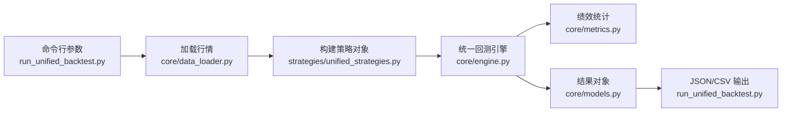

可以。`run_unified_backtest.py` 是这套新系统的总入口，它负责把 `core/` 和 `strategies/` 串起来。

**整体关系图**


**入口文件怎么串起来**
[run_unified_backtest.py](/Users/lidongyang/Desktop/Qstrategy/run_unified_backtest.py) 的执行顺序很清晰：

1. 解析命令行参数  
   例如：
   ```bash
   python3 run_unified_backtest.py B1 /path/to/data --max-positions 10
   ```
   这里会读出：
   - 跑哪个策略
   - 数据目录
   - 初始资金
   - 最大持仓数
   - 是否导出交易明细、净值、信号

2. 加载行情数据  
   调用 [core/data_loader.py](/Users/lidongyang/Desktop/Qstrategy/core/data_loader.py) 里的 `load_price_directory(args.data_dir)`  
   输出两样东西：
   - `stock_data`：每只股票一张标准化后的 DataFrame
   - `all_dates`：全市场统一交易日历

3. 构建策略对象  
   调用 `build_strategy(...)`，按名字实例化：
   - `B1Strategy`
   - `B2Strategy`
   - `B3Strategy`
   - `PinStrategy`
   - `BrickStrategy`

   这些类都在 [strategies/unified_strategies.py](/Users/lidongyang/Desktop/Qstrategy/strategies/unified_strategies.py)。

4. 创建回测引擎  
   用 [core/engine.py](/Users/lidongyang/Desktop/Qstrategy/core/engine.py) 里的：
   - `EngineConfig`
   - `BacktestEngine`

   这里把初始资金、最大持仓数这些公共参数传进去。

5. 正式运行回测  
   调用：
   ```python
   result = engine.run(strategy, stock_data, all_dates)
   ```
   这一步是核心。引擎会：
   - 先让策略 `prepare`
   - 再让策略 `generate_signals`
   - 把信号映射到次日执行
   - 执行买卖
   - 更新现金和持仓
   - 生成净值曲线和交易记录

6. 输出结果  
   最后 `run_unified_backtest.py` 把结果写出去：
   - 汇总 JSON：策略名、metrics、diagnostics、trade_count
   - 可选交易明细 CSV
   - 可选净值曲线 CSV
   - 可选信号 CSV

**各文件在调用链里的位置**

[run_unified_backtest.py](/Users/lidongyang/Desktop/Qstrategy/run_unified_backtest.py)  
负责“调度”。它自己不写策略逻辑，也不写撮合逻辑，只负责把各模块拼起来。

[core/data_loader.py](/Users/lidongyang/Desktop/Qstrategy/core/data_loader.py)  
负责“输入标准化”。把原始 `.txt` 行情变成系统认识的统一格式。

[strategies/unified_strategies.py](/Users/lidongyang/Desktop/Qstrategy/strategies/unified_strategies.py)  
负责“信号生成”。这里只定义策略什么时候买，不负责资金和成交。

[strategies/common.py](/Users/lidongyang/Desktop/Qstrategy/strategies/common.py)  
负责“策略公共指标工具”。给 B1/B2/B3/PIN/BRICK 复用。

[core/engine.py](/Users/lidongyang/Desktop/Qstrategy/core/engine.py)  
负责“统一执行与账户”。这是回测引擎本体。

[core/market_rules.py](/Users/lidongyang/Desktop/Qstrategy/core/market_rules.py)  
负责“交易规则”。比如涨跌停、ST、创业板制度切换。

[core/metrics.py](/Users/lidongyang/Desktop/Qstrategy/core/metrics.py)  
负责“结果评价”。把净值曲线转成收益率、回撤、夏普。

[core/models.py](/Users/lidongyang/Desktop/Qstrategy/core/models.py)  
负责“统一数据结构”。把信号、持仓、交易、结果都规范下来。

**一句话理解这套架构**
- `strategies/` 决定买什么
- `core/` 决定怎么买、怎么卖、怎么记账、怎么算结果
- [run_unified_backtest.py](/Users/lidongyang/Desktop/Qstrategy/run_unified_backtest.py) 决定怎么把它们跑起来

如果你要，我下一步可以继续给你讲两件事里的任意一个：
1. 这套系统里一次完整回测在 `BacktestEngine.run()` 里每天到底发生了什么  
2. B1、B2、B3、PIN、BRICK 五个策略在新系统里的具体信号逻辑对照表